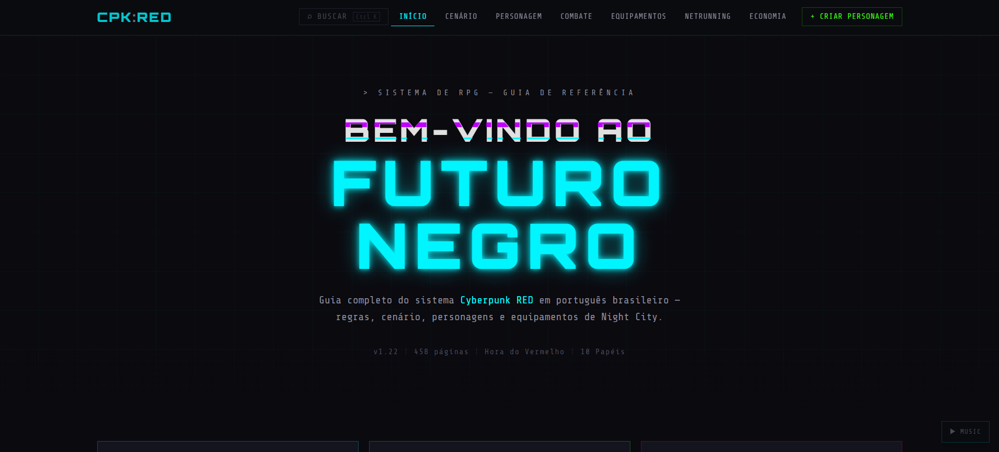

# CPK Red — Referência Cyberpunk RED

Site de referência rápida para o RPG **Cyberpunk RED**, com conteúdo organizado por seções temáticas e estética cyberpunk. Gerado como site estático via Next.js.



## Seções

| Rota            | Conteúdo                                               |
| --------------- | ------------------------------------------------------ |
| `/cenario`      | Lore, Night City, fações                               |
| `/personagem`   | Atributos, skills, roles (página por role)             |
| `/combate`      | Regras de combate, ações, condições                    |
| `/equipamentos` | Armas, armaduras, cyberware (com filtro por categoria) |
| `/netrunning`   | Regras de netrunning, programas, ICE                   |
| `/economia`     | Preços, eurobucks, lifestyle                           |

## Stack

- **Next.js 16** com `output: "export"` — sem SSR, sem API routes
- **Tailwind CSS v4** — tokens configurados em `src/app/globals.css`
- **TypeScript** — interfaces em `src/lib/types.ts`, dados em `src/data/*.ts`

## Desenvolvimento

Requer Node.js:

```bash
pnpm dev      # servidor em localhost:3000
pnpm build    # export estático para out/
pnpm lint     # eslint
```

## Estrutura

```
src/
  app/          # rotas Next.js (page.tsx por seção)
  components/
    ui/         # primitivos: NeonCard, Table, Tag, GlitchText, ...
    sections/   # componentes de domínio (consomem src/lib/types.ts)
    layout/     # Header, Footer, Sidebar
    home/       # componentes exclusivos da home
  data/         # conteúdo do jogo como arrays/objetos TypeScript
  lib/
    types.ts    # interfaces de todos os tipos de dados
```

Para adicionar ou editar conteúdo do jogo, edite os arquivos em `src/data/`. Atualize `src/lib/types.ts` primeiro se o shape mudar.

## Licença

MIT — veja [LICENSE](../LICENSE).
